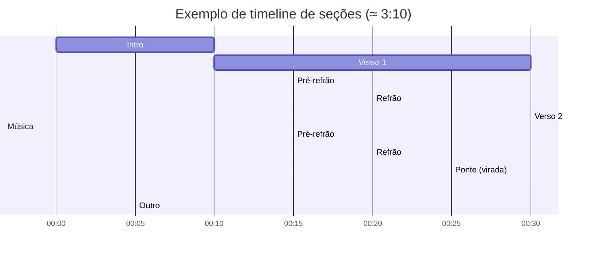

# Guia pt-BR para compor letras de música de sucesso em qualquer gênero

## Resumo executivo

Letras que “funcionam” em muitos contextos tendem a combinar dois motores ao mesmo tempo: **clareza + surpresa**. Clareza vem de estruturas reconhecíveis (verso–refrão, repetição planejada, linguagem direta o suficiente para ser acompanhada), enquanto surpresa vem de detalhes específicos (imagens sensoriais, viradas narrativas, metáforas novas, uma frase-gancho única). Estudos de larga escala mostram que, nas últimas décadas, letras populares ficaram **mais simples e mais repetitivas** em vários gêneros, com aumento de repetição de linhas e de seções de refrão. citeturn2search1turn2search6

Essa repetição não é “preguiça”: ela é um **mecanismo de sentido e memória**. Pesquisas sobre “earworms” (músicas que grudam) destacam repetição como componente central do fenômeno, especialmente quando fragmentos se repetem de modo contíguo (quase em loop). citeturn0search2turn8search3turn8search11 Em paralelo, trabalhos em psicologia do ritmo e prosódia sugerem que quando **acentos da fala** (sílabas tônicas) se alinham melhor ao **pulso** percebido, há ganhos de compreensão e acompanhamento do canto. citeturn9search10turn9search18turn9search2

Para contar histórias reais de pessoas sem depender de conhecimento musical, o caminho mais confiável é tratar a letra como um **mini-roteiro**: (1) uma ideia central memorizável (hook), (2) versos que mostram cenas e conflito, (3) um refrão que “resume” a emoção com linguagem cantável, e (4) uma ponte (opcional) que muda perspectiva e intensifica o final. A literatura sobre narrativa em letras sugere que canções frequentemente usam estruturas narrativas reconhecíveis (com começo, desenvolvimento e resolução/virada), mesmo em formatos curtos. citeturn3search0turn3search21

O guia abaixo transforma essas evidências e práticas em um método **simples, ultra detalhado e reutilizável**, incluindo: princípios universais, técnicas emocionais, adaptações por gênero, processo de entrevista e escrita, modelos, checklists, métricas de teste e exemplos originais curtos em gêneros diferentes.

## O que quase toda letra memorável tem em comum

### A ideia central: “um mapa simples + momentos fortes”
Pense numa canção como uma sequência de “salas” que o ouvinte visita. Cada sala tem um papel. Em hits contemporâneos, o mapa mais comum é o **verso–refrão**, frequentemente com **pré-refrão** (um trecho de transição que aumenta a expectativa antes do refrão). Um estudo musicológico sobre o pré-refrão descreve justamente essa função de **focalizar atenção e preparar o impacto do refrão**, e discute sua prevalência em repertório popular. citeturn0search4

A seguir estão definições práticas (para leigos) e “o que cada parte deve entregar”:

**Verso (estrofe)**  
Entrega: **história em movimento**. Mostra contexto, personagem, lugar, hábito, época, ou “o problema”. A letra muda a cada verso para avançar a narrativa.

**Refrão (chorus)**  
Entrega: **a mensagem cantável e repetível**. Normalmente repete as mesmas linhas (ou quase) em todas as repetições. Por isso é o lugar natural do **hook** (gancho).

**Hook (gancho)**  
Entrega: **a frase (ou ideia) que fica**. Pode estar no refrão (mais comum), no pós-refrão, no começo do verso, ou até ser um bordão rítmico. Pesquisas sobre memória musical e “grude” ressaltam como repetição e saliência de trechos específicos contribuem para lembrança involuntária. citeturn0search2turn4search0turn4search3

**Pré-refrão (pre-chorus)**  
Entrega: **subida de tensão**. Linguagem costuma ficar mais urgente (“e aí…”, “só que…”, “mas quando…”), preparando o refrão.

**Ponte (bridge / middle-8)**  
Entrega: **curva inesperada**. Muda o ângulo: novo insight, nova decisão, novo tempo (“anos depois”), troca de ponto de vista (“eu” → “você”), ou uma confissão. Muitas vezes é o trecho que dá profundidade emocional.

**Intro / Outro (abertura/fecho)**  
Entrega: **convite e despedida**. Em alguns gêneros a intro já traz o hook; em outros, cria clima.

### Repetição X variação: o equilíbrio que o cérebro entende
A crítica “música pop é repetitiva” ignora que repetição é a base do reconhecimento e da coerência: ela separa “sentido” de “ruído”. Uma análise acadêmica sobre repetição em canções verso–refrão argumenta que, em muitos casos, há um equilíbrio entre material repetido e material novo, com o papel das “variações” sendo crucial para continuidade e significado. citeturn0search0

Ao mesmo tempo, grandes análises mostram que letras populares têm ficado **mais repetitivas** ao longo de décadas (por exemplo, maior proporção de linhas repetidas), e isso aparece em múltiplos gêneros. citeturn2search1turn2search6  
Uma leitura prática: repetição aumenta **memorização e cantabilidade**, mas variação sustenta **interesse**.

**Regra utilizável para leigos:**  
- Repetir **a ideia central** (refrão/hook) = bom.  
- Repetir **frases genéricas** (clichês) = ruim.  
- Variar **detalhes concretos** (cenas, objetos, horários, apelidos) = ótimo.

### Duração e ritmo de atenção: por que “chegar logo” importa
Há evidências jornalísticas e de dados de mercado indicando que a **duração média de músicas populares** diminuiu muito desde os anos 1990, chegando perto da casa dos “três e poucos minutos” em décadas recentes, ainda que existam oscilações. citeturn1search6turn1search2 Pesquisas e análises sobre a era do streaming discutem como isso pode pressionar por **entradas mais rápidas** (ex.: refrão mais cedo) e por estruturas que prendam atenção cedo. citeturn4search2turn4search8

**Faixas práticas (não regras) para planejar letra sem música:**
- Canção “rápida e direta”: 2:00–2:40 (1–2 versos curtos + refrão forte).  
- Canção “história completa”: 2:40–3:40 (2 versos + refrão + ponte).  
- Canção “cinematográfica”: 3:40+ (mais cenas, ponte longa e/ou 3º verso).  
A tendência de compressão torna especialmente valioso: **apresentar o tema e o hook mais cedo**. citeturn1search6turn4search2

### Métrica, rima e “ritmo verbal”: o som da fala como cola emocional
Mesmo sem saber música, você consegue controlar “musicalidade” em três níveis:

**Métrica (na prática):** quantidade e distribuição de sílabas por linha, e o padrão de “batidas” da fala. Pesquisas sobre poesia e linguagem mostram que padrões de métrica e rima impactam **envolvimento emocional e apreciação estética**. citeturn9search1

**Rima:** sons parecidos no fim (ou dentro) das linhas. Além de tradição mnemônica, há evidência de que rima pode aumentar “fluidez” de processamento e até influenciar julgamentos (em outro domínio linguístico, frases rimadas tendem a soar mais “verdadeiras” do que versões não rimadas). citeturn1search0turn1search4

**Ritmo verbal e prosódia:** onde caem as sílabas tônicas e as palavras importantes. Estudos com medidas neurais sugerem que alinhar **estresse linguístico** e **pulso musical** melhora rastreamento do beat e compreensão das letras. citeturn9search10turn9search18 Pesquisas sobre inteligibilidade e reconhecimento de palavras cantadas também investigam efeitos de prosódia, repetição e acento métrico na percepção das palavras. citeturn9search2turn0search1

**Como aplicar sem teoria musical (técnica “boca e mão”):**
1. Leia cada linha em voz alta como se fosse fala dramática.  
2. Bata palmas naturalmente (uma palma por “batida” que você sente).  
3. Se a palma cai numa sílaba fraca (“de”, “a”, “o”) e a palavra forte fica “fora”, reescreva.  
Isso aproxima sua letra do que estudos de prosódia sugerem sobre alinhamento e compreensão. citeturn9search10turn9search18

### Um mapa de tempo típico (para visualizar estrutura sem música)
O formato abaixo é um **exemplo didático** de distribuição de seções em uma faixa por volta de 3:00–3:20 (você pode encurtar ou alongar). A lógica “subir → explodir → respirar → explodir mais → virar → final” organiza atenção e emoção, coerente com a função do pré-refrão e do refrão em formas populares. citeturn0search4turn0search0



## Narrativa e emoção

### Por que letras emocionam: imaginação, memória e expectativa
Modelos psicológicos sobre emoção musical destacam mecanismos como **imagem mental** e **memória episódica** (lembranças pessoais disparadas pela música), além de **expectativa** (tensão e resolução). citeturn3search1turn3search4 Letras potencializam exatamente esses mecanismos quando criam cenas imagináveis e “ganchos” que ativam memórias (“isso já aconteceu comigo”). citeturn3search4turn3search22

**Tradução para prática:** se você quer uma canção personalizada e emocional, você quer gerar **imagens** + **reconhecimento** + **virada**.

### Ponto de vista: quem fala com quem
Escolher ponto de vista é escolher um tipo de intimidade.

- **Primeira pessoa (“eu”)**: confissão, diário, vulnerabilidade.  
- **Segunda pessoa (“você”)**: conversa direta, cobrança, carinho, promessa. Em psicologia da linguagem, há evidências de que o “você” pode aumentar perspectiva e impacto persuasivo em compreensão narrativa em vários contextos. citeturn3search16  
- **Terceira pessoa (“ele/ela”)**: cinema, observação, “história de alguém”.

**Atalho para leigos:**  
Se a história é “de alguém” (homenagem), comece em 3ª pessoa no verso e migre para 2ª no refrão (“você”), para criar proximidade no momento mais repetido.

### Arco narrativo: a canção como mini-filme
Pesquisas sobre letras como narrativa investigam se músicas seguem estruturas narrativas parecidas com histórias mais longas. citeturn3search0 Mesmo quando a canção não conta uma trama “completa”, ela pode sugerir um arco com quatro batidas:

1. **Situação** (onde estamos, quem é)  
2. **Desejo** (o que falta, o que quer)  
3. **Conflito** (o que impede, o erro, o medo, o tempo)  
4. **Mudança** (decisão, aceitação, pedido, despedida)

Esse modelo também conversa com abordagens que analisam letras segundo “contextos narrativos” (romance, vida cotidiana, superação etc.). citeturn3search21turn3search17

### Conflito: a emoção nasce do “quase”
Sem conflito, a letra vira descrição. Conflito não precisa ser briga; pode ser:
- desejo vs medo  
- amor vs orgulho  
- fé vs dúvida  
- rotina vs sonho  
- saudade vs distância  
A “ponte” é o lugar perfeito para revelar *o que estava escondido* (a verdade que o verso não disse).

### Imagens sensoriais e linguagem concreta: “mostre” em vez de explicar
A diferença entre “eu estava triste” e “eu encostei a testa no vidro do ônibus e vi a rua passar” é a diferença entre **abstração** e **imagem**.

E isso não é só estética: o “efeito de concretude” mostra que palavras concretas (com imagem mental fácil) tendem a ser processadas mais rapidamente e com mais precisão do que palavras abstratas, associado a teorias de dupla codificação (verbal + imagética). citeturn1search13turn1search9

**Ferramenta prática: Banco de 5 sentidos (para personalização)**
Para cada cena importante, responda:
- O que a pessoa **vê**? (luz, cor, lugar, objeto)  
- O que **ouve**? (som da rua, voz, notificação)  
- O que **cheira**? (café, chuva, perfume)  
- O que **toca**? (volante, lençol, corrimão)  
- O que **prova**? (sal, cerveja, bolo, remédio)

Depois, coloque **1 detalhe sensorial por linha** (não mais), para não “pesar” a letra.

### Metáforas e símbolos: dizer mais do que as palavras
Metáforas não são enfeite: elas estruturam como pensamos. A teoria de metáforas conceituais (associada a entity["people","George Lakoff","linguist"] e entity["people","Mark Johnson","philosopher"]) descreve como entendemos domínios abstratos (amor, tempo, dor) por meio de domínios concretos (guerra, viagem, clima). citeturn3search15turn3search2

No Brasil, há trabalhos acadêmicos analisando o uso de metáforas na obra de entity["musical_artist","Chico Buarque","brazilian singer-songwriter"], mostrando como figuras de linguagem podem carregar sentidos complexos. citeturn6search1

**Como criar metáforas sem “poetês”:**
1. Pegue a emoção-alvo (ex.: saudade).  
2. Pergunte: “Se isso fosse um objeto/clima/lugar, o que seria?”  
3. Escolha 1 metáfora que combine com a pessoa real (história personalizada).  
   - Saudade como “rua molhada”, “casa com eco”, “mensagem não enviada”.  
4. Use a metáfora **uma vez no verso** e **uma variação no refrão** (para virar assinatura).

### Autenticidade: a técnica que mais “vende” emoção
Não existe medidor universal de autenticidade, mas há pistas linguísticas fortes:
- detalhes verificáveis (apelidos, horários, objetos específicos)  
- contradições humanas (“eu fui embora… mas fiquei”)  
- imperfeições e “linhas tortas” (uma frase que soa falada, não escrita)

A semiótica da canção no Brasil enfatiza a canção como algo muito próximo da fala, e discute a relação entre melodia, ritmo e dicção/entoação. citeturn11search9turn11search1 Mesmo fora de uma análise musical, essa ideia ajuda o leigo: **escreva como a pessoa falaria no momento mais verdadeiro da história**.

## Como modular para cada gênero sem saber música

### A regra-mãe: mantenha a história, troque a embalagem
Você pode contar a mesma história em pop, sertanejo, rap, funk, gospel, metal ou jazz mudando principalmente:
- **densidade de palavras** (quantas palavras por linha)  
- **grau de repetição** (quanto o refrão volta)  
- **registro de linguagem** (coloquial, poético, litúrgico, agressivo)  
- **tipo de imagem** (cotidiano, urbano, simbólico, espiritual)  
- **“energia” verbal** (calma, urgente, explosiva)

Abaixo, “padrões típicos” (não obrigações). Use como ponto de partida.

### Pop
Foco: **hook imediato + refrão grande + frases curtas**.  
Tendências de repetição e simplificação em letras pop e outros gêneros aparecem em análises diacrônicas, sugerindo valor da **fluidez** e repetição planejada. citeturn2search1turn2search6  
Como modular:
- refrão com 1 frase-título repetida  
- imagens simples, universais, mas com 1 detalhe pessoal (o “diferencial”)

### Rock
Foco: **atitude + frase marcante + imagens fortes**.  
Estrutura pode ser verso–refrão, mas há mais abertura para versos longos e pontes intensas. A discussão de formas (verso–refrão e variações) em teoria musical de música popular reforça o papel do refrão e do hook como centro de memória. citeturn0search16  
Como modular:
- linguagem mais direta, menos “decorada”  
- metáforas mais visuais (“vidro”, “ferrugem”, “fogo”)  
- conflito mais explícito (raiva, inconformismo)

### Sertanejo
Foco: **história cotidiana + emoção nomeada + refrão de fácil coro**.  
Há literatura acadêmica e análises socioculturais mostrando diversidade temática e transformações do sertanejo universitário, com destaque para temas como balada e vida cotidiana em certos períodos. citeturn1search11turn1search3  
Como modular (sem estereotipar):
- cenário concreto (bar, estrada, cidade pequena, mensagem no celular)  
- refrão com “virada” emocional (“eu volto / eu não volto”, “eu bloqueio / eu desbloqueio”)  
- rimas simples e sonoras (mais “cantáveis” do que “impressionantes”)

### Funk
Foco: **repetição hipnótica + bordão + chamada e resposta**.  
Estudos de discurso em letras de funk (por exemplo, no subgênero “ostentação”) analisam como letras veiculam identidades e práticas sociais, o que ajuda a entender por que bordões e marcas de posição social são tão recorrentes. citeturn6search0turn10search21  
Como modular:
- hook com poucas palavras (2–6), repetidas  
- versos curtos e “falados”, com gírias coerentes ao personagem real  
- 1 imagem forte por bloco (carro, baile, rua, suor, neon)

### Rap
Foco: **fluxo de palavras + rimas internas + narrativa em primeira pessoa**.  
Pesquisas sobre prosódia no rap analisam a interface entre fala e música e descrevem “flow” como um encaixe rítmico complexo entre sílabas e pulso. citeturn10search2turn10search22 No Brasil, trabalhos acadêmicos discutem flow, métrica, rima e a batida em loop como parte do gênero. citeturn10search19turn6search13  
Como modular:
- use rimas internas discretas (não precisa “travar língua”)  
- versos mais longos, com imagens urbanas e detalhes biográficos  
- refrão pode ser simples (quase mantra) para equilibrar densidade de versos

### MPB
Foco: **camadas de sentido + metáforas + observação humana**.  
Há produção acadêmica extensa sobre música popular brasileira (MPB) e seus contextos, incluindo discussões sobre letra, metáfora e leitura dialógica. citeturn6search10turn6search14  
Como modular:
- menos repetição literal; mais repetição de **ideia** (variações)  
- imagens poéticas ligadas ao cotidiano (cozinha, quintal, calçada, mar)  
- ponte como “filosofia concreta” (um pensamento em cena)

### Jazz vocal
Foco: **forma clássica (ex.: AABA) + espaço para interpretação**.  
Textos sobre standards mencionam formas como AABA/ABAC e o papel de “choruses” repetidos para reforço e variação interpretativa. citeturn7search20turn7search7  
Como modular (sem precisar saber harmonia):
- letras com frases mais longas e “conversadas”  
- menos bordão; mais elegância e precisão  
- use repetições com pequenas mudanças (sinônimos, inversões)

### Eletrônica
Foco: **frases mínimas + atmosfera + repetição como transe**.  
O “texto” pode ser fragmentado porque a força vem do loop e do clima; ainda assim, a repetição é uma alavanca de memória (inclusive no fenômeno de earworms). citeturn0search2turn8search3  
Como modular:
- hook de 1–2 linhas; muito repetido  
- versos opcionais; se existirem, curtos e imagéticos  
- palavras com som bom (aliteração, vogais abertas)

### Metal
Foco: **intensidade + catarse + temas sombrios ou épicos** (variável por subgênero).  
Estudos com fãs de metal extremo sugerem que ouvintes usam esse tipo de música para processar raiva e regular emoções, experimentando energia e inspiração. citeturn7search0 Trabalhos de análise de letras apontam temas recorrentes em repertórios de metal (violência, angústia, protesto, mitos), embora isso não defina todo metal. citeturn7search12turn7search9  
Como modular:
- imagens fortes e concretas (não genéricas)  
- conflito intenso (interno ou social)  
- refrão pode ser curto e “gritado” (poucas palavras com peso)

### Gospel
Foco: **testemunho + adoração + mensagem clara**.  
Análises do discurso emocional em letras gospel e testemunhos destacam construção de sentidos ligados a louvor/adoração e à experiência religiosa. citeturn7search18  
Como modular:
- use uma narrativa de transformação (antes → encontro → depois)  
- refrão como declaração (promessa, gratidão, pedido)  
- linguagem respeitosa, com imagens bíblicas se fizer sentido à pessoa

## Método passo a passo para criar letras personalizadas a partir de histórias reais

### Visão geral do processo
Abaixo, um fluxo completo pensado para leigos. Ele é coerente com o que pesquisas sugerem sobre repetição, prosódia, memória e narrativa: primeiro você encontra um **núcleo repetível** (hook/refrão) e depois constrói cenas que levam até ele. citeturn0search4turn2search1turn9search10turn3search0

```mermaid
flowchart TD
A[Escolher a pessoa e o objetivo da canção] --> B[Entrevista: coletar cenas, frases e detalhes]
B --> C[Definir emoção central + mensagem em 1 frase]
C --> D[Criar hook: 5 a 9 palavras memoráveis]
D --> E[Esboçar refrão: 2 a 4 linhas com repetição]
E --> F[Esboçar versos: 2 cenas + conflito + progressão]
F --> G[Adicionar pré-refrão (opcional): tensão e promessa]
G --> H[Adicionar ponte (opcional): virada de perspectiva]
H --> I[Revisão cantável: ritmo verbal, sílabas, rimas]
I --> J[Teste com pessoas: emoção, lembrança, sing-along]
J --> K[Ajustes: cortar excesso, reforçar imagens, clarificar]
```

### Entrevista: perguntas que geram “material de letra” (não só informação)
O maior erro em letras personalizadas é coletar fatos e esquecer **cenas**. Use perguntas que puxem imagem, som e fala real.

A tabela abaixo é um roteiro de entrevista (20–30 minutos) que costuma render versos inteiros.

| Bloco | Perguntas que rendem letra |
|---|---|
| Contexto | “Quando essa história começa (ano/idade/estação)?” “Onde você estava morando?” |
| Personagens | “Quem era seu ‘porto seguro’?” “Quem você evitava? Por quê?” |
| Cenas (cinema) | “Me descreve 3 cenas como se fosse filme: o que tinha na mesa? que horas? que roupa?” |
| Frases reais | “Qual foi uma frase que te marcou?” “O que você disse e se arrependeu?” |
| Objeto-símbolo | “Se essa fase tivesse um objeto, qual seria?” |
| Som e rotina | “Qual barulho marca esse período?” “Qual caminho você fazia sempre?” |
| Conflito | “O que você queria e não conseguia?” “Qual foi o medo mais repetido?” |
| Virada | “Qual foi o momento ‘antes/depois’?” |
| Verdade difícil | “O que você nunca falou, mas queria que alguém entendesse?” |
| Final aberto | “Hoje, o que você deseja pra essa pessoa/para você?” |

**Dica de ouro:** peça permissão para usar **nomes reais**. Se não puder, substitua por apelidos (mais íntimos e ainda assim anônimos).

### Transformando entrevista em letra: a planilha mental “1–3–1”
Para leigos, a forma mais fácil de transformar história em música é esta:

- **1 frase** (o coração) → vira o hook do refrão  
- **3 cenas** (filme) → viram partes dos versos/ponte  
- **1 decisão** (mudança) → vira ponte ou último refrão

**Modelo preenchível (copie e complete):**
- Emoção central: __________  
- Mensagem em uma frase (“eu quero que a pessoa sinta que…”): __________  
- Hook (5–9 palavras): __________  
- Cena 1 (onde/objeto/som): __________  
- Cena 2 (conflito/choque/descoberta): __________  
- Cena 3 (consequência/saudade/celebração): __________  
- Decisão (eu aceito / eu volto / eu perdoo / eu sigo): __________

### Construindo o refrão primeiro (por quê e como)
Há evidência de que repetição e fluidez ajudam popularidade e memorização, então começar pelo refrão costuma reduzir bloqueio criativo: você cria a “âncora” repetida e depois cola as cenas nela. citeturn8search2turn2search1turn0search2

**Template de refrão (alto aproveitamento em qualquer gênero):**
- Linha 1: **título/hook** (curta, repetível)  
- Linha 2: explicação emocional (uma imagem)  
- Linha 3: repetição do hook (igual ou com 1 palavra mudada)  
- Linha 4: consequência (“e eu…”, “a gente…”, “Deus…”, “você…”)

Exemplo (estrutura, não conteúdo):
- “__________”  
- “__________ (imagem concreta)”  
- “__________ (hook de novo)”  
- “__________ (promessa/decisão)”

### Versos como cenas: “mostre 1 coisa por linha”
**Checklist de verso bom (micro):**
- Cada linha contém: 1 imagem + 1 ação (mesmo pequena)  
- Você ouve a pessoa falando (não um narrador genérico)  
- O verso não repete o refrão (ele prepara)

**Template de verso em 8 linhas (prático):**
1. Onde estou  
2. O que vejo  
3. O que faço  
4. O que isso significa (subtexto)  
5. Algo muda  
6. Eu reajo  
7. Eu escondo/peço/desisto  
8. Gancho verbal para o pré-refrão (“mas…”)

### Pré-refrão e ponte: quando usar (e como não errar)
O pré-refrão ficou comum por um motivo funcional: ele cria “teleologia” (sensação de que algo está chegando), preparando o refrão. citeturn0search4 Use se seu verso é muito descritivo e você precisa de um “degrau” emocional.

A ponte funciona como virada narrativa. Uma boa ponte faz uma destas ações:
- muda tempo (passado → presente)  
- muda endereço (eu → você)  
- muda tese (“eu dizia X, mas era Y”)  

### Exercícios rápidos para destravar e melhorar
Sem teoria musical, você pode evoluir rápido com exercícios curtos:

**Exercício “5 versões do hook” (10 minutos)**  
Escreva 5 hooks para a mesma mensagem mudando:
- pergunta / afirmação  
- “eu” / “você”  
- concreto / simbólico  
Escolha o que é mais fácil de repetir sem cansar (fluidez). citeturn8search2turn2search6

**Exercício “metáfora personalizada” (8 minutos)**  
Pegue um detalhe real (objeto da entrevista) e transforme em símbolo (uma vez no verso, uma vez no refrão). Baseado na ideia de metáforas conceituais (abstrato por concreto). citeturn3search15turn3search2

**Exercício “prosódia de fala” (5 minutos)**  
Grave seu verso lendo como fala. Depois reescreva só as linhas que “engasgam”. Estudos sobre prosódia em canção ligam alinhamento rítmico à compreensão e acompanhamento. citeturn9search10turn9search2

### Prompts e modelos para reutilizar (inclusive com IA)
Você pode usar estes prompts em qualquer editor/IA (ou como auto-instrução). Eles foram escritos para **não exigir conhecimento musical**:

**Prompt “extração de letra a partir de entrevista”**  
> Transforme esta história em letra. Gere: (a) hook de 7 palavras, (b) refrão de 4 linhas com repetição, (c) 2 versos com cenas concretas, (d) ponte com virada. Evite clichês, use 6 detalhes sensoriais reais. Linguagem: [gênero]. Público: [idade]. Emoção: [emoção].  

**Prompt “controle de concretude”**  
> Reescreva o verso, trocando palavras abstratas por imagens concretas, mantendo a mesma mensagem.  

A motivação por trás disso é consistente com evidências sobre concretude e imagem mental facilitando processamento. citeturn1search13turn1search9

## Exemplos curtos originais em gêneros diferentes e comparação por gênero

Os exemplos abaixo são **originais** e propositalmente **curtos**, para você enxergar estrutura e técnicas.

### Exemplo em pop
**Verso 1**  
Na tela do meu celular teu nome acende e some,  
eu finjo que nem vi, mas o peito muda o rumo.  
O café esfria e eu volto a mesma cena:  
meu dedo no “enviar” tremendo em câmera lenta.

**Pré-refrão**  
E toda vez que eu digo “já passou”,  
vem tua risada e corta a minha voz.

**Refrão (hook)**  
**Me deixa te dizer** o que eu calei demais,  
na rua, no ônibus, nas noites iguais.  
**Me deixa te dizer**: eu fui embora por medo,  
mas teu nome mora aqui—e não sai do meu peito.

### Exemplo em sertanejo
**Verso**  
No balcão aquele copo que você sempre pedia,  
a música do bar tocando a nossa teimosia.  
Eu juro que eu tentei ser forte, dar risada,  
mas a saudade chega e senta do meu lado.

**Refrão (hook)**  
Eu tô bem… só que eu desmorono quando falam seu nome,  
eu tô bem… só que a cidade inteira lembra você e some.  
Se eu te bloquear, eu desbloqueio no segundo,  
cê foi embora e levou metade do meu mundo.

### Exemplo em funk
**Intro (fala)**  
Ó… presta atenção.

**Refrão (hook)**  
**Hoje eu não volto atrás** (não), não volto atrás (não),  
eu dei meu coração e você fez distração.  
**Hoje eu não volto atrás**, pode chamar, pode chorar,  
minha paz tá no comando—aprendi a me amar.

**Verso**  
Mensagem no display, eu deixo no visto,  
no meu bairro a noite brilha, meu passo é compromisso.  
Se eu lembro do teu beijo, eu lembro do motivo:  
eu não sou teu intervalo, eu sou meu próprio abrigo.

### Exemplo em rap
**Verso (16 linhas curtas, estilo falado)**  
Eu era “vai dar certo” com o bolso sem certeza,  
inventando amanhã pra aguentar a correnteza.  
Minha mãe fala baixo pra não acordar o medo,  
eu falo alto pra ver se eu acredito no que eu digo.  
No busão, madrugada, olho preso na vitrine,  
me vejo em cada rosto que também não se define.  
Eu tive pressa, tive fome, tive culpa, tive fé,  
tive amigo que sumiu quando a conta ficou em pé.  
Aprendi que o “desculpa” não compra tempo perdido,  
que orgulho é uma prisão com porta sem sentido.  
Se eu caio, eu recomponho, peça por peça, no chão,  
minha história não é vitrine: é construção.  
Hoje eu volto pra casa com o coração mais claro,  
o mesmo caos por fora, mas por dentro eu me preparo.  
Se o mundo muda lento, eu mudo no meu ritmo:  
eu não sou fim de linha—eu sou começo vivo.

**Refrão (mantra/hook)**  
Eu sigo, eu sigo—mesmo quando ninguém vê,  
minha vitória é ficar de pé.

### Tabelas comparativas de estruturas e técnicas por gênero

A tabela abaixo resume estruturas **comuns** (não obrigatórias) e o “ponto de força” lírico em cada gênero.

| Gênero | Estrutura lírica mais frequente (ponto de partida) | Densidade de palavras | Onde o hook costuma estar | Força principal |
|---|---|---:|---|---|
| Pop | Verso → Pré → Refrão → Verso → Pré → Refrão → Ponte → Refrão | Média | Refrão/pós | Memorização + universalidade citeturn0search4turn2search1 |
| Rock | Verso → Refrão → Verso → Refrão → Ponte/solo → Refrão | Média | Refrão/riff verbal | Atitude + imagens fortes citeturn0search16 |
| Sertanejo | Verso narrativo → Refrão forte → Verso → Refrão | Baixa–média | Refrão | História cotidiana + emoção direta citeturn1search11turn1search3 |
| Funk | Refrão (bordão) → Verso curto → Refrão (muitos ciclos) | Baixa | Refrão | Repetição + chamada/resposta citeturn6search0turn0search2 |
| Rap | Verso longo (história) → Refrão curto → Verso longo → Refrão | Alta | Refrão/mantra | Flow + biografia + impacto verbal citeturn10search2turn10search19 |
| MPB | Versos com variações + refrão menos literal (às vezes) | Média | Pode variar | Camadas de sentido + metáfora citeturn6search10turn6search1 |
| Jazz vocal | AABA / ABAC (texto longo e conversado) | Média | Tema A | Interpretação + variação citeturn7search20turn7search7 |
| Eletrônica | Hook curto em loop + versos opcionais | Baixa | Hook/loop | Atmosfera + repetição citeturn8search3turn0search2 |
| Metal | Verso → Refrão (ou não) → Ponte/virada → Clímax | Média | Refrão ou slogan | Catarse + intensidade citeturn7search0turn7search12 |
| Gospel | Verso testemunho → Refrão declaração → Ponte elevação | Baixa–média | Refrão | Mensagem clara + transformação citeturn7search18 |

A próxima tabela é sobre “controles” que você ajusta sem saber música.

| Controle | Pop | Sertanejo | Funk | Rap | Gospel |
|---|---:|---:|---:|---:|---:|
| Repetição literal | Alta citeturn2search1 | Alta | Muito alta citeturn0search2 | Média | Média |
| Concretude (objetos/cenas) | Média | Alta | Alta | Alta | Média |
| Metáfora/símbolo | Média | Baixa–média | Baixa | Média | Média–alta citeturn3search15turn7search18 |
| Densidade verbal | Média | Baixa–média | Baixa | Alta citeturn10search2 | Baixa–média |
| Tom “fala” (dicção) | Média | Alta | Alta | Muito alta | Média citeturn11search9 |

## Testes, métricas de sucesso e recursos em português

### O que é “sucesso” para sua letra: métricas qualitativas e mensuráveis
Você pode medir sucesso em três camadas: **emoção**, **memória** e **participação**.

#### Engajamento emocional
**Qualitativo (rápido):**
- “O que você sentiu?” (1 frase)  
- “Qual imagem ficou?” (1 coisa)  
- “Em que linha você acreditou mais?” (1 linha específica)

**Mensurável (simples):**
- Escala 0–10 de emoção (tristeza, esperança, saudade, alegria) antes e depois de ouvir/lendo.  
- “Pico emocional” por timestamp (mesmo sem música: peça para apontar o trecho do texto).

A ideia de mapear emoção dialoga com revisões sobre mecanismos de emoção musical (imagem mental, memória episódica etc.). citeturn3search4turn3search22

#### Memorização
Pesquisas sobre “earworms” e repetição sugerem que trechos repetidos e salientes são mais propensos a “grudar”. citeturn0search2turn8search3turn4search0

**Teste caseiro de memória (sem tecnologia):**
1. Mostre a letra (ou cante/recite) 2 vezes.  
2. Depois de 10 minutos, pergunte:  
   - “Qual é a frase principal?” (hook)  
   - “Você lembra o começo do refrão?”  
3. Após 24 horas, repita a pergunta.

**Métrica:** % de pessoas que lembram o hook corretamente.

#### Sing-alongability (vontade de cantar junto)
Sing-along é social: estudos sobre canto em grupo mostram efeitos de **vínculo social** mais rápido e sensação de conexão. citeturn8search0turn8search8 Mesmo que você não vá cantar em grupo, isso inspira um teste: se a letra é fácil de cantar junto, ela tende a ser mais compartilhável em contextos sociais.

**Teste simples:**
- Dê o refrão para 3 pessoas e peça para lerem em voz alta juntas.  
- Se travarem em sílabas e acentos, revise prosódia (alinhamento fala–ritmo), apoiado por evidências de que alinhamento prosódico melhora compreensão e acompanhamento. citeturn9search10turn9search2

**Métrica:** número de tropeços por refrão (meta: 0–1).

### Checklist de revisão final (reutilizável)
Use como “controle de qualidade” antes de mostrar a alguém:

- O refrão tem **um hook** que cabe numa respiração curta?  
- O hook aparece pelo menos **3 vezes** na letra? (sem virar chato) citeturn0search0turn2search1  
- Cada verso traz **cenas concretas** (não só emoções abstratas)? citeturn1search13  
- Existe **conflito** claro (mesmo que interno)? citeturn3search0  
- A ponte (se existe) muda algo de verdade (tempo, perspectiva, decisão)?  
- Ao ler em voz alta, as palavras importantes caem naturalmente na ênfase? citeturn9search10  
- Você consegue resumir a canção em **1 frase** que bate com o refrão?

### Ferramentas e recursos recomendados (priorizando português e fontes primárias)
Abaixo vai uma curadoria com foco em pt-BR e materiais com credibilidade acadêmica ou institucional quando possível.

**Base brasileira sobre canção (teoria e análise)**
- entity["book","O Cancionista","luiz tatit 1996"] (obra de referência sobre canção popular no Brasil; página institucional da editora universitária). citeturn11search4turn11search0  
- Artigos acadêmicos discutindo conceitos de dicção e prosódia na canção associados a entity["people","Luiz Tatit","brazilian linguist"]. citeturn11search1turn11search9  
- Pesquisa (tese/dissertação) sobre metáforas em canções de Chico Buarque (útil para aprender figuras de linguagem aplicadas). citeturn6search1  

**Narrativa e emoção (acadêmico, acesso aberto)**
- Estudo sobre letras e estrutura narrativa em canções. citeturn3search0  
- Revisões sobre mecanismos de emoção induzida por música (imagem mental e memória episódica como chaves para emoção). citeturn3search1turn3search4  

**Memória, repetição e “grude”**
- Revisão sobre “involuntary musical imagery” (earworms) e repetição. citeturn0search2  
- Artigos sobre repetição contígua e loops em earworms. citeturn8search3turn8search11  

**Prosódia e cantabilidade**
- Evidências neurais sobre alinhamento de estresse linguístico e métrica musical em canções. citeturn9search10turn9search18  
- Estudo sobre fatores que influenciam inteligibilidade/reconhecimento de palavras cantadas (inclui prosódia e repetição). citeturn9search2turn0search1  

**Estrutura de hits e pré-refrão**
- Trabalho musicológico sobre função e disseminação do pré-refrão. citeturn0search4  
- Análise de repetição em canções verso–refrão (por que repetição e variação coexistem). citeturn0search0  

**Referências úteis sobre “simplicidade” e popularidade (cuidado: correlação ≠ fórmula)**
- Pesquisas relacionando fluidez/legibilidade e popularidade em letras (ex.: medidas de “processing fluency”). citeturn8search2turn8search18  
- Análises de tendência de simplificação e repetição ao longo de décadas. citeturn2search1turn2search6  

**Ferramentas para o dia a dia do letrista (pt-BR)**
- Dicionários e sinônimos (para substituir abstrato por concreto e evitar repetição de palavras).  
- Ferramentas de rima em português (para testar rimas finais e internas sem forçar clichê).  
- Gravador de voz do celular (para o teste de prosódia e fluência).  
- Plataformas de feedback (enquetes com amigos; teste A/B de dois refrões).

**Direitos autorais no Brasil (para quem vai publicar)**
- Orientações em português sobre registro e proteção de obras musicais, citando associações como entity["organization","UBC","brazilian music authors"] e entity["organization","ABRAMUS","brazilian collecting society"] (referência introdutória). citeturn5search3  

### Referências selecionadas
Incluem, entre outras: estudos sobre repetição e simplificação em letras ao longo do tempo citeturn2search1turn2search6; processamento/fluidez e popularidade citeturn8search2turn8search18; pré-refrão citeturn0search4; prosódia e compreensão citeturn9search10turn9search2; narrativa em letras citeturn3search0turn3search21; emoção musical citeturn3search1turn3search4; earworms e repetição citeturn0search2turn8search3turn4search0; metáfora e concretude citeturn3search15turn1search13turn1search0; e materiais brasileiros sobre canção e análise de letras citeturn11search4turn11search1turn6search1turn6search0turn7search18.